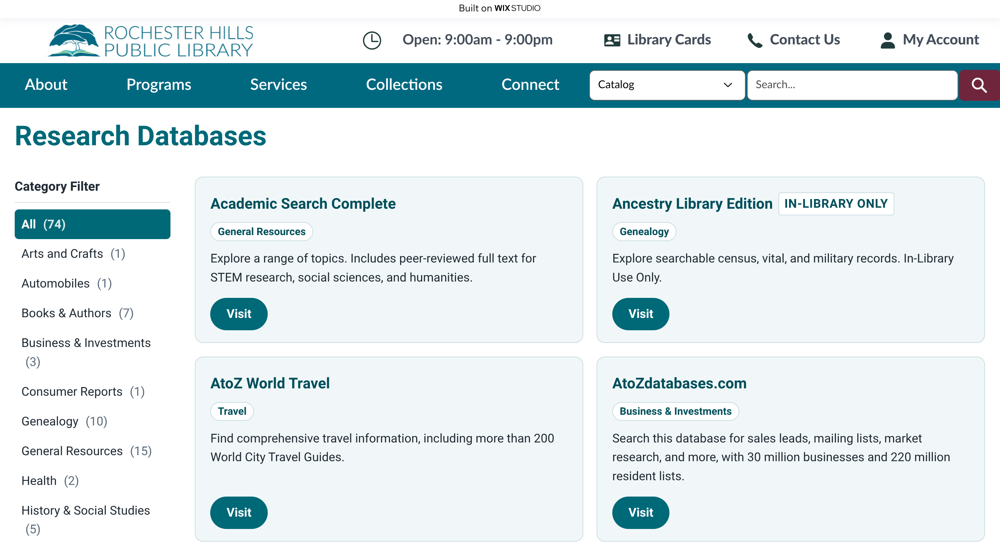
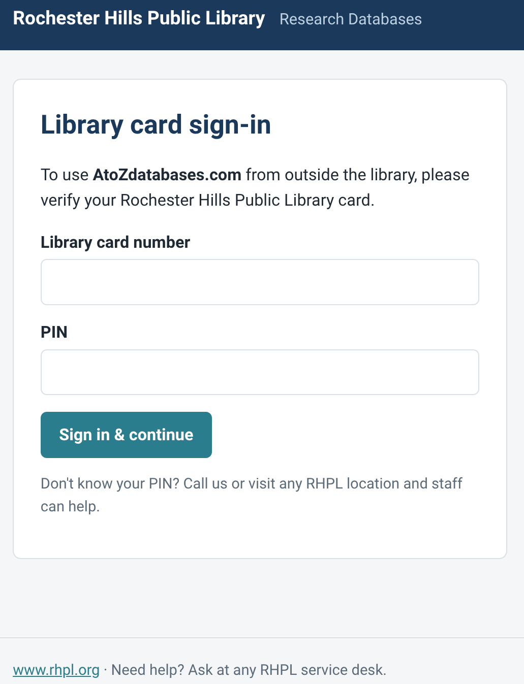
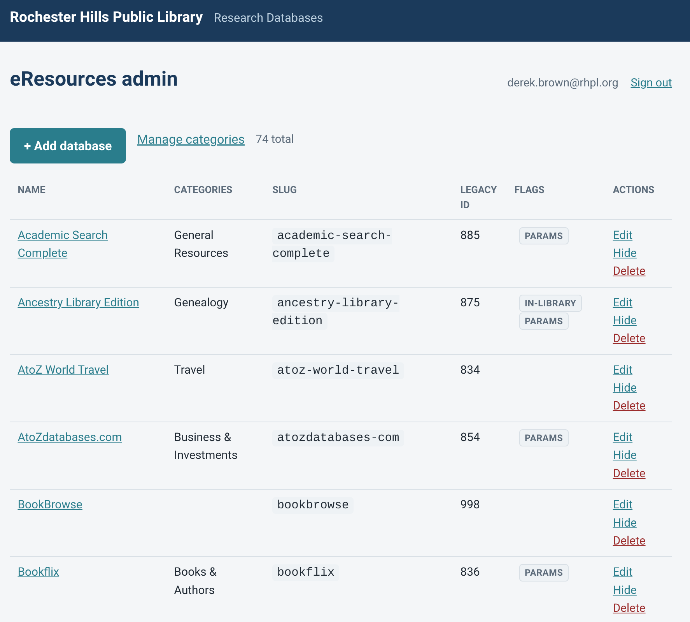
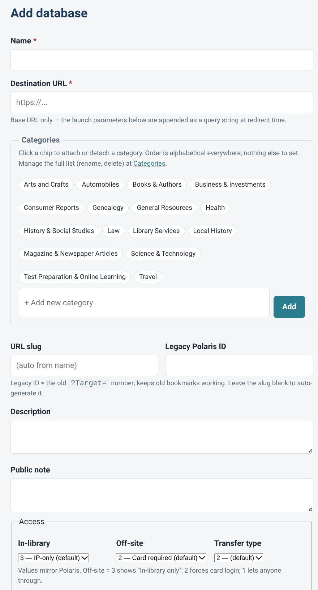
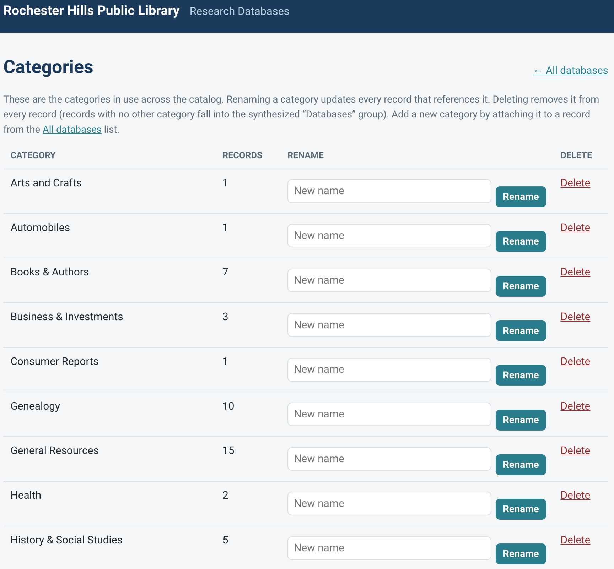
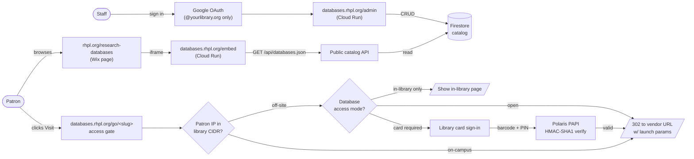

# Research Database Gateway

**Replaces the Polaris classic-PAC eSources feature.** A small Cloud Run app + Firestore catalog + Wix-embeddable patron page that gives staff a modern admin UI for managing subscription databases and gives patrons the same on-campus IP bypass, library-card sign-in, and in-library-only access controls they're used to — without depending on the classic PAC.

Built by Rochester Hills Public Library (RHPL). Reference deployment lives at `databases.rhpl.org`, embedded into the library's Wix site at `rhpl.org/research-databases`. **Free to run** — fits inside GCP's free tier (~$0/month at the RHPL scale of ~74 databases and a typical library's traffic).

> [!IMPORTANT]
> **This service is currently in beta at RHPL.**
> - **Back end** (Cloud Run + Firestore catalog) — live at `databases.rhpl.org`. Staff actively edit the catalog there.
> - **Patron-facing iframe** — currently embedded on RHPL's Wix testing server at [vegapromoteweb.wixstudio.com/rhpl-studio/databases-iframe](https://vegapromoteweb.wixstudio.com/rhpl-studio/databases-iframe) while we work with the database vendors to whitelist `databases.rhpl.org` as the incoming referrer (the patron's browser sends it as the Referer header on launch) in addition to the existing `rhpl.org` / `catalog.rhpl.org` entries on their authentication allow-lists.
> - **Production cutover** — once the last vendor confirms the new domain, the iframe migrates to [rhpl.org/research-databases](https://www.rhpl.org/research-databases).
>
> Everything described below already works on the back end; only the *where the iframe is embedded* changes between beta and production.

---

## What patrons see

The patron-facing page lives on Wix (or wherever your library hosts its public site). Research Database Gateway renders a Wix-embeddable catalog via an iframe so it picks up your site's branding automatically while staying always-in-sync with what staff edit on the back end.



When a patron clicks **Visit** on a database card, the request goes to the access gate. From there:

- **On a library Wi-Fi or wired network** → request bypasses authentication and goes straight to the database (just like classic PAC did with the in-building IP check).
- **From home, work, or a phone on cellular**, for any database that requires it → patron is asked to verify their library card and PIN:



- **For databases that are licensed for in-library use only** → off-site patrons see an "in-library only" page; the card sign-in is not offered. (Matches the license terms RHPL agreed to with those vendors.)

---

## What staff see

One admin UI for the whole catalog, signed in with a Google Workspace account from a domain you control:



Each database has a single edit form covering everything — name, destination URL, categories (chip-toggle UI, alphabetical, no fiddly ordering numbers), the legacy Polaris `Target=` ID so old patron bookmarks keep working, description text, and the access flags that mirror Polaris's own `InHouseAccess` / `RemoteAccess` enums.



Categories are managed as a separate panel — rename a category and every record using it updates atomically; delete a category and it's stripped from every record. No orphan-category state to clean up.



**The Wix page updates automatically.** Staff don't touch Wix at all — when they save a change in `/admin`, the next time a patron loads `rhpl.org/research-databases`, the iframe re-fetches the catalog JSON and the change is live. One source of truth, no "now go update the Wix page too" tax on staff time.

---

## How it fits together (traffic flow)



**Three things make this work:**

1. **Firestore is the single source of truth** for the catalog. Both `/admin` (staff CRUD) and `/api/databases.json` (Wix-consumed JSON) read from it. Editing in `/admin` propagates to Wix on the next page load — no batch jobs, no manual sync.
2. **The access gate (`/go/<slug>`) enforces the rules**, not the patron's browser. A patron can't bypass the in-library-only check by editing a URL because the IP detection happens server-side at Cloud Run, after Firebase Hosting has appended the real client IP to `X-Forwarded-For`.
3. **Vendor credentials never reach the patron's browser unencrypted at rest.** Database launch parameters (the `key=value` query-string fragments many vendors use for authentication) live in Firestore Fernet-encrypted; they only get decrypted server-side at the moment of the 302 redirect.

---

## Access model

The service mirrors Polaris's own access semantics so existing licensing decisions carry over without re-thinking them. Each database has two access enums, both with the same three values:

| Value | Meaning |
|---|---|
| 1 — **Open** | Anyone, no card check |
| 2 — **Card required** | Patron must sign in with library card + PIN |
| 3 — **IP-only** | Granted by being on a library IP; no card login offered |

Two enums, one per context:

- **`in_house_access`** controls behavior when the request is from a library IP
- **`remote_access`** controls behavior off-site

The gate combines them into the decision:

| Patron is | `remote_access` is | Outcome |
|---|---|---|
| On a library IP | (any value of `in_house_access`) | Open or IP-only → grant. Card required → ask for card. |
| Off-site | `1` (open) | Grant — no login needed |
| Off-site | `2` (card required) | Show card sign-in; on PAPI success → grant |
| Off-site | `3` (IP-only) | Show "in-library only" page — sign-in is not offered |

Plus a per-database **`blocked_patron_code_ids`** list that mirrors Polaris's "patron codes to restrict" UI: after card auth, the patron's `PatronCodeID` (fetched via PAPI `PatronBasicDataGet`) is checked against this list to enforce per-resource patron-type rules. RHPL uses this on 7 databases where licensing requires excluding some patron types (Non-Resident, MILibrary, Collection Agency, etc.).

---

## What changed compared to the Polaris classic PAC

The classic PAC's eSources feature works, but:

- **It lives inside Polaris**, which means every patron-facing decision (does this page look the way we want? does this vendor URL still work?) is also a Polaris-staff-client decision, gated by Innovative's release cycle.
- **The patron page is the Polaris UI**, which doesn't match your library's web brand.
- **Staff edit databases inside the Polaris admin**, which has a learning curve and isn't designed around modern web workflows (no chip-toggle category UI, no rename-cascade, no live preview).
- **Vega doesn't currently offer a first-party replacement**, and Polaris's classic PAC is in maintenance mode — eventually it goes away.

What this project does differently:

- **Patron page lives on your existing public website** (Wix, in RHPL's case, but any site that can embed an iframe works). Same brand, same nav, no new patron URL to learn.
- **Staff admin is its own clean web app**, accessible via the library's existing Google Workspace sign-in. No new account to manage; offboarding a staff member from Google Workspace also revokes their `/admin` access automatically.
- **The catalog data lives in Firestore**, which you own. No vendor lock-in.
- **Old patron bookmarks keep working.** Every record carries its `legacy_entry_id` (the Polaris `Target=` number), and `databases.rhpl.org/esources?Target=NNN` 302s to the new URL.

---

## Migrating from Polaris (one-time, MS SQL → Firestore)

You don't recreate 70-200+ databases by hand. The repo includes SQL scripts that extract the existing eResources data straight from your Polaris MS SQL database and a Python importer that loads it into Firestore.

```
migrate/
├── 01_discover_attributes.sql         # find your DWI attribute names
├── 02_extract_esources.sql            # extract databases + categories + params
├── 03_discover_patroncode_polarity.sql # confirm Polaris block-list semantics
└── import_extract.py                  # CSV → Firestore (idempotent, upsert by legacy_entry_id)
```

Workflow:

1. Run `01_discover_attributes.sql` against your Polaris MS SQL database to find the attribute names your library uses for the URL, description, and the access flags. Note them.
2. Edit `02_extract_esources.sql` with those names, run it, save the result sets as UTF-8 CSVs into `migrate/extract/`.
3. Dry-run the importer (`python migrate/import_extract.py --dry-run`) to preview; then run it for real to write Firestore.

The importer is idempotent — safe to re-run. It upserts by `legacy_entry_id`, so re-running against a fresh extract is how you sync future changes one-way out of Polaris.

**Save staff weeks of work.** RHPL extracted 246 databases this way and never had to touch the admin UI to seed the initial catalog.

---

## Why this stack

Most libraries can't justify a dedicated server, a sysadmin's time, and a $500/year hosting bill for a database list. The architecture choices here aim to make the running cost approximately $0:

| Component | Why |
|---|---|
| **Cloud Run** | Scale-to-zero. You pay for actual request-handling time, not idle servers. At a typical library's traffic, this stays under the 2M-requests-per-month free tier. |
| **Firestore (Native)** | A library's catalog is ~200 docs. That's well under Firestore's free-tier limits (1 GB storage, 50K reads / 20K writes per day). |
| **Firebase Hosting** | Gives you a custom domain with managed SSL, no Load Balancer required. (Skipping the GCP external Load Balancer saves ~$18/month — meaningful at this scale.) |
| **Secret Manager** | Free for the first 6 secrets; this app uses 4. |
| **Cloud Build** | 120 build-minutes per day free. A deploy takes ~2 minutes. |
| **Google Workspace OAuth** | If your library already uses Google Workspace for staff email and Drive, OAuth is one config away — no new identity provider to run. |

Total cost at RHPL after 2 weeks in production: **$0**. We set a $5/year budget alert as a guardrail.

If your library uses Microsoft 365 instead of Google Workspace, the OAuth integration is the only piece that needs adapting. The Cloud Run + Firestore part still works because GCP is independent of your office stack.

---

## For other libraries: adapting this

Almost nothing in the codebase is RHPL-specific. The pieces that need to change for your library are deliberately env-var / config-driven:

- **PAPI base URL, App ID, Org ID, access key** — your Polaris PAPI credentials
- **`PUBLIC_CIDRS`** — your library's public IP ranges (comma-separated CIDR)
- **`ADMIN_EMAIL_DOMAIN`** — the email domain that can sign in to `/admin` (e.g. `yourlibrary.org`)
- **Google OAuth client** — create one in your GCP project
- **`PUBLIC_BASE_URL`** — the patron-facing domain (e.g. `databases.yourlibrary.org`)
- **The Wix integration** — adapt the iframe URL to point at your Cloud Run deployment

What this means is: you fork this repo, fill in your `.env` from `.env.example`, run the SQL extract once against your Polaris DB, deploy, and embed the iframe on your existing patron site. The patron experience and the staff admin UI come along for the ride.

If your library doesn't use Wix, the catalog also renders at `/` directly — you can simply link patrons to `databases.yourlibrary.org` and skip the iframe embed.

---

## Cost

**Expected $0/month** at typical library scale. Cloud Run scale-to-zero, Firestore (~200 docs), Secret Manager (4 secrets), Firebase Hosting, Cloud Build, and Cloud Logging all sit inside their free tiers. Set a ~$5/year budget alert as a guardrail.

The design choices deliberately keep the free tier in play: Firestore (not Cloud SQL) for catalog storage; Firebase Hosting (not an external Load Balancer) for the custom domain.

---

## First-time setup

Prereqs: a GCP project (e.g. `your-library-esources`) with billing linked; `gcloud` and `firebase` CLIs; project-owner access.

1. **Provision GCP infrastructure**
   ```
   PROJECT=your-library-esources ./infra/setup-gcp.sh
   ```
   Enables APIs, creates the Firestore database, the `esources-run` service account, IAM bindings, and the login-counter TTL policy. It prints the remaining manual steps — do them:

2. **Create the four Secret Manager secrets** (commands printed by the script):
   `esources-secret-key`, `esources-fernet-key`, `esources-google-client-secret`, `esources-papi-api-secret`.
   Keep a copy of the Fernet key — the migration importer needs the same one.

3. **Create the OAuth client** — GCP console → APIs & Services → Credentials → OAuth 2.0 Client (Web). Authorized redirect URI: `https://your-eresources-domain.org/admin/callback`.

4. **Create `.env`** from `.env.example`. For deployment only the non-secret values are needed: `PUBLIC_BASE_URL`, `GOOGLE_CLIENT_ID`, `PUBLIC_CIDRS` (your library's public IP ranges), `TRUSTED_PROXY_HOPS`, etc. The four secrets come from Secret Manager, not `.env`.

5. **Budget alert** — Billing → Budgets → ~$5/year.

## Deploy

```
./deploy.sh
```

Builds the container (Cloud Build), deploys to Cloud Run, prints the service URL. Then connect the custom domain:

```
firebase projects:addfirebase your-library-esources
firebase deploy --only hosting,firestore:rules --project your-library-esources
```

and add your gateway domain as a custom domain in the Firebase console (create the DNS record it asks for).

## Cutover

- Repoint the "Research Databases" menu on your patron site to your gateway domain.
- Old `.../esources.aspx?Target=NNN` links are handled by `/esources?Target=NNN`.
- After ~30-60 days of confirmed traffic, retire the Polaris eSource segment. Keep the DWI tables read-only as an archive; keep a backup of the CSVs.

## Verify

```
.venv/bin/python -m pytest -q                 # 53 unit tests
```

End-to-end checks worth doing before cutover:

- **IP detection** — set `ENABLE_WHOAMI=1`, hit `/whoami` from a library workstation (expect `on_campus: true`) and off-site (`false`). If wrong, adjust `TRUSTED_PROXY_HOPS` and redeploy. Disable `/whoami` afterwards.
- **PAPI** — off-site, a good card + PIN signs in; a bad barcode and a bad PIN both give the same generic error.
- **Session expiry** — set `SESSION_MINUTES=1`, confirm re-prompt after a minute.
- **In-library-only** — off-site, a flagged resource shows the in-library page.
- **Credentials** — a resource with launch parameters opens the vendor URL with credentials applied.
- **Admin** — your `@yourlibrary.org` accounts can CRUD; other domains are rejected.
- **Bookmark** — `/esources?Target=<legacy id>` redirects to `/go/<slug>`.

## Repo layout

```
.
├── AGENTS.md             # rules any AI coding agent must follow in this repo
├── Dockerfile            # Cloud Run container image
├── deploy.sh             # Cloud Build + Cloud Run deploy
├── pyproject.toml        # Package metadata and runtime deps
├── .env.example          # Configuration reference (copy to .env locally)
├── .gitleaks.toml        # Custom rules for the secret scanner
├── .github/workflows/    # CI: sensitive-content scan on push and PR
├── src/esources/         # Flask application package
│   ├── main.py           # app factory, gunicorn entry point
│   ├── config.py         # env-var loading
│   ├── papi_client.py    # Polaris PAPI auth client
│   ├── gateway.py        # pure access-decision function
│   ├── crypto.py         # Fernet vendor-credential encryption
│   ├── ratelimit.py      # Firestore-backed login throttle
│   ├── ip_check.py       # on-campus detection
│   ├── store.py          # Firestore accessors
│   ├── util.py           # pure helpers
│   └── routes/           # Flask blueprints: public, admin, api
├── templates/            # Jinja templates
├── static/               # CSS
├── tests/                # pytest suite (53 tests)
├── infra/                # firebase.json, firestore.rules, setup-gcp.sh
├── migrate/              # one-time data migration scripts from Polaris
├── docs/                 # Wix integration notes and other long-form docs
└── screenshots/          # Annotated UI screenshots referenced in this README
```

## Local development

```
python3 -m venv .venv
.venv/bin/pip install -e .[dev]
.venv/bin/python -m pytest -q
```

Running the full app locally needs a `.env` (copy from `.env.example`) and Firestore access (`gcloud auth application-default login`); then:

```
.venv/bin/gunicorn esources.main:app --bind 127.0.0.1:8080
```

## Security guidance for contributors (AI tools)

This is a public repository. If you use AI coding tools (Claude Code, Antigravity, Cursor, Copilot, ChatGPT, Gemini, etc.) to work on this code, treat the AI's context window as **non-confidential**. Anything you paste into a prompt may be logged, used for model training, or visible to the service provider's staff.

**Do not paste secrets, private patron data, or full internal network diagrams into AI prompts; treat the AI context as non-confidential.** Specifically avoid:

- Library patron data (names, card numbers, contact info, borrowing history)
- API keys, OAuth client secrets, service-account JSON, `PAPI_API_SECRET`, `FERNET_KEY`, `SECRET_KEY`, or any value from your `.env` or Secret Manager
- Full internal network diagrams or your library's IP allocation tables
- Vendor account credentials (EBSCO refurl IDs, Gale account numbers, etc.)

When debugging requires real data, prefer a local LLM (your hardware, no upload), a development environment with synthesized fixtures, or manual inspection without AI assistance. The `AGENTS.md` in this repo instructs AI agents to decline if asked to consume the above and to remind you of this rule.

## Operations

- **Logs** — Cloud Logging (Cloud Run console). Login successes/failures and admin changes are logged; barcodes/PINs and vendor passwords never are.
- **Add/edit databases** — the admin UI at `/admin`.
- **Rotate a secret** — add a new Secret Manager version, redeploy. Rotating `esources-secret-key` logs out all sessions. Do **not** rotate `esources-fernet-key` without re-encrypting stored vendor passwords.
- **Login lockout** — 5 attempts / 15 min per IP and per barcode (`LOGIN_RATE_MAX`, `LOGIN_RATE_WINDOW_MIN`); a successful login clears it.

---

Built at Rochester Hills Public Library, shared so other libraries can move off classic PAC without re-inventing the wheel. MIT-licensed; contributions welcome.
